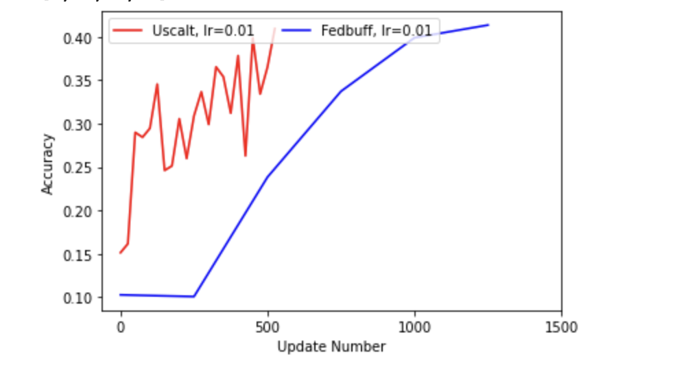
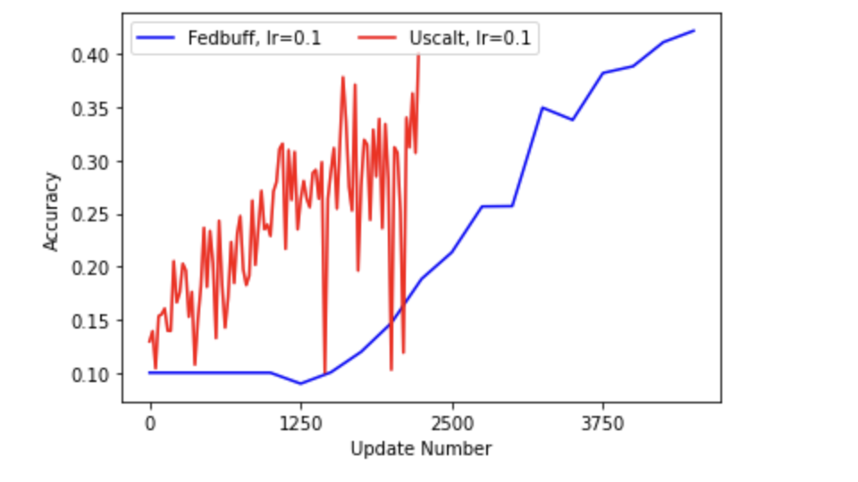
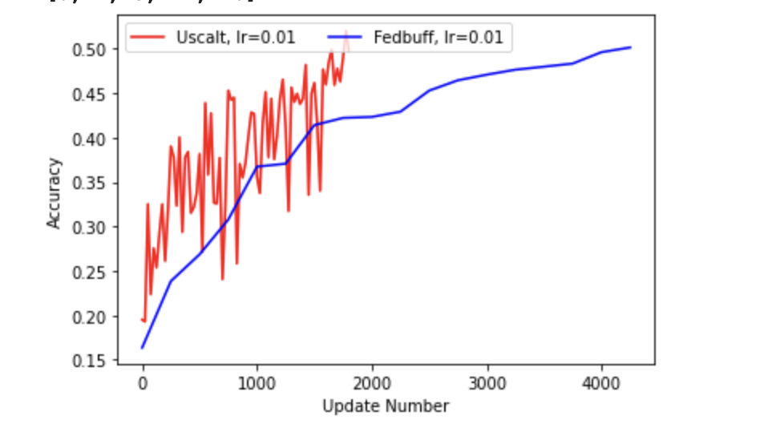

# Code from the Federated Learning section of the Uscalt BT Young Scientist project

## IMPORTANT AMMENDMENTS

We have made ammendments to files due to there being a mistake. The files contained a training function that would load the current model after loading a stale model. This is incorrect and was not how we trained our models in the main CIFAR-10 and Yahoo Answers tasks. However, we did use this when training our 20 client model and we have rectified and retrained. It's also the code we show in our appendices. We apologise for this. In addition to retriaining, we trained a buffered Async FL model (fedbuff.py) to compare it to. Below are updated figures for the task (all trained with 20 clients).

Training with Learning Rate = 0.01 (to reach 40% accuracy)

Training with Learning Rate = 0.1 (to reach 40% accuracy)

Training with Learning Rate = 0.01 (to reach 50% accuracy)

Our model reaches 40% accuracy in the first of the three tasks in 63% less updates.
Our model reaches 40% accuracy in the second of the three tasks in 47% less updates.
Our model reaches 50% accuracy in the third of the three tasks in 61% less updates.

-------
All of the files contain code to load and create ***different*** dataset splits for each client. 

However, the dataset splits remain the same throughout each experiment (the datasets were shuffled and split once, and they were saved and loaded as needed).
 `yahoo.py` contains only the dataloading and model definitions. The training and helper functions are the exact same as in `cifar_sync` and `cifar_async`
